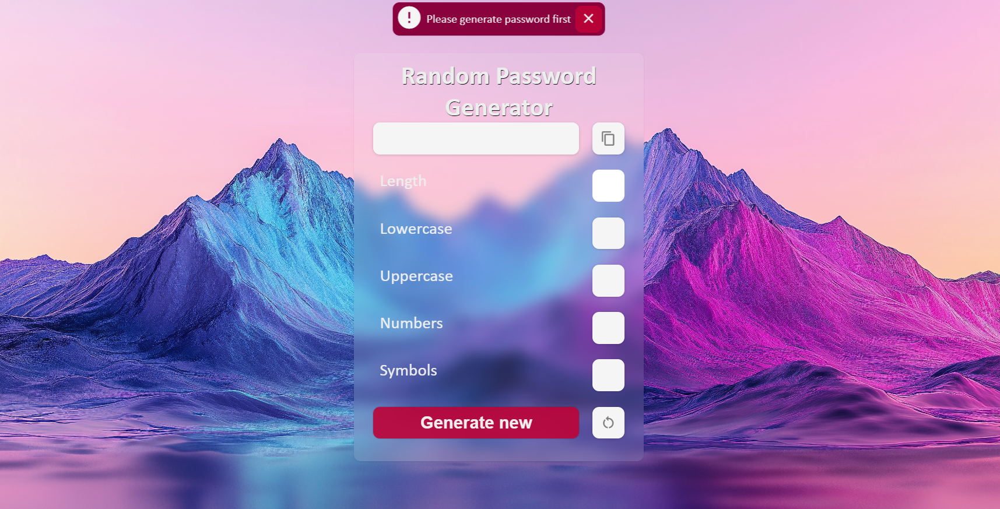

# RANDOM PASSWORD GENERATOR

A Random Password Generator built with HTML, CSS, and JavaScript that allows users to generate secure passwords based on selected criteria. The project includes error handling, a stylish UI, and an intuitive user experience.
## 📸 PREVIEW 

## 🚀 Features

- **Password Box**: Displays the generated password.

- **Copy Password Button**: Allows users to copy the generated password.

- **Generate Password Button**: Generates a random password based on user selections.

- **Regenerate Button**: Refreshes the password with the same settings.

- **Error Modal**: Displays validation errors if conditions are not met.

### Password Criteria Options:

- Uppercase Letters

- Lowercase Letters

- Numbers

- Symbols

#### Validation Checks:

Password length must be between 8 and 20 characters.

Password cannot be empty.

At least one checkbox must be selected.

## 🛠️ Technologies Used

- **HTML**: Structure of the webpage.

- **CSS**: Custom styling for a visually appealing design.

- **JavaScript**: Password generation logic and user interactions.

- **Google Material Icons**: Used for the copy and regenerate buttons.

- **Background Image**: Enhances the visual appeal of the UI.

## 🎨 UI & Styling

- Responsive and modern design.

- A beautiful background image for an enhanced user experience.

- Styled buttons with hover effects.

- Well-designed error modal to alert users of validation errors.